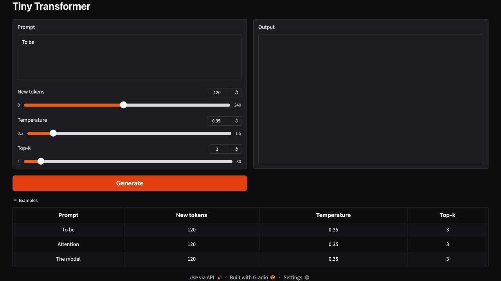

# Tiny Transformer

A compact GPT-style language model built from scratch in PyTorch. This repo is designed to show the fundamentals recruiters actually care about: clean architecture, readable math, reproducible training, tests, and an end-to-end demo path from raw text to generated tokens.

## Hosted Playground

[Try the Gradio demo on Hugging Face Spaces](https://huggingface.co/spaces/axay28/tiny-transformer).



## What Makes This Worth Looking At

- Implements a decoder-only Transformer without Hugging Face or high-level training frameworks.
- Includes causal self-attention, multi-head attention, residual blocks, layer norm, embeddings, generation, and checkpointing.
- Ships with character and byte-pair encoding tokenizers so the model can train on any plain-text file.
- Keeps the code small enough to understand in one sitting, but structured like production Python.
- Includes smoke tests for masking, shapes, tokenization, attention export, and generation behavior.

## Quickstart

```bash
python3 -m venv .venv
source .venv/bin/activate
python -m pip install -e ".[dev]"
```

Train on the included sample text:

```bash
tiny-transformer train --data data/tiny_shakespeare_excerpt.txt --steps 300 --device cpu
```

Use the optional BPE tokenizer, gradient accumulation, and mixed precision when you want a stronger local run:

```bash
tiny-transformer train \
  --data data/tiny_shakespeare_excerpt.txt \
  --tokenizer bpe \
  --bpe-vocab-size 128 \
  --grad-accum-steps 4 \
  --amp \
  --device mps
```

Generate text from a checkpoint:

```bash
tiny-transformer generate --checkpoint runs/tiny-transformer.pt --prompt "To be" --max-new-tokens 160
```

Export an attention heatmap:

```bash
tiny-transformer attention --checkpoint runs/tiny-transformer.pt --prompt "To be" --output runs/attention.svg
```

Launch the local playground:

```bash
tiny-transformer serve --checkpoint runs/tiny-transformer.pt
```

Deploy the hosted playground:

```bash
pip install huggingface_hub
hf auth login
hf repos create axay28/tiny-transformer --type space --space-sdk gradio --public --exist-ok
git remote add space https://huggingface.co/spaces/axay28/tiny-transformer
git push space main
```

Run tests:

```bash
pytest
```

## Project Layout

```text
src/tiny_transformer/
  cli.py          Command line interface for training and generation
  config.py       Model and training configuration
  data.py         Text dataset and batching utilities
  model.py        GPT-style Transformer implementation
  tokenizer.py    Character-level tokenizer
  train.py        Training loop, evaluation, checkpointing
  visualize.py    Attention heatmap export
  web.py          Local generation playground
tests/            Unit and smoke tests
data/             Tiny sample corpus
```

## Architecture

The model is intentionally small, but it follows the same structure as larger decoder-only LLMs:

1. Token and positional embeddings convert IDs into vectors.
2. Each Transformer block applies pre-norm causal self-attention.
3. Feed-forward layers expand and compress the hidden dimension.
4. Residual connections preserve gradient flow.
5. A tied-size language modeling head predicts the next token.

The attention mask is causal, so each position can only attend to itself and previous positions.

```mermaid
flowchart LR
    A["Raw text corpus"] --> B["Char or BPE tokenizer"]
    B --> C["Token IDs"]
    C --> D["Contiguous train/val batches"]
    D --> E["Token + position embeddings"]
    E --> F1["LayerNorm"]
    F1 --> F2["Masked multi-head self-attention"]
    F2 --> F3["Residual add"]
    F3 --> F4["LayerNorm"]
    F4 --> F5["Feed-forward MLP"]
    F5 --> F6["Residual add"]
    F6 --> F7["Repeat for N layers"]
    F7 --> G["Final layer norm"]
    G --> H["Language modeling head"]
    H --> I["Next-token logits"]
    I --> J["Cross-entropy loss during training"]
    I --> K["Top-k sampling during generation"]
    F2 --> L["Attention heatmap export"]
    K --> M["Local web playground"]
```



## Example Configuration

The CLI defaults train quickly on CPU. For the included tiny corpus, the command uses a
32-token context window; for larger text files, 128 tokens is a good next step:

```python
ModelConfig(
    vocab_size=128,
    block_size=128,
    n_layer=4,
    n_head=4,
    n_embd=128,
    dropout=0.1,
)
```

Increase `n_layer`, `n_head`, and `n_embd` for a stronger demo once the training loop is validated.

## Model Card

The hosted Gradio demo uses a deliberately tiny character-level checkpoint trained on the
sample corpus in `data/tiny_shakespeare_excerpt.txt`. The checkpoint is meant to demonstrate
the end-to-end Transformer pipeline: tokenization, causal masking, training, checkpoint
loading, and top-k sampling.

This model is useful for inspecting architecture and generation mechanics, not for factual
answers or broad language understanding. Its outputs are best with prompts similar to the
sample corpus, such as `To be`, `Attention`, or `The model`. Higher temperature settings can
produce noisy text because the model is intentionally small and trained on a compact dataset.
